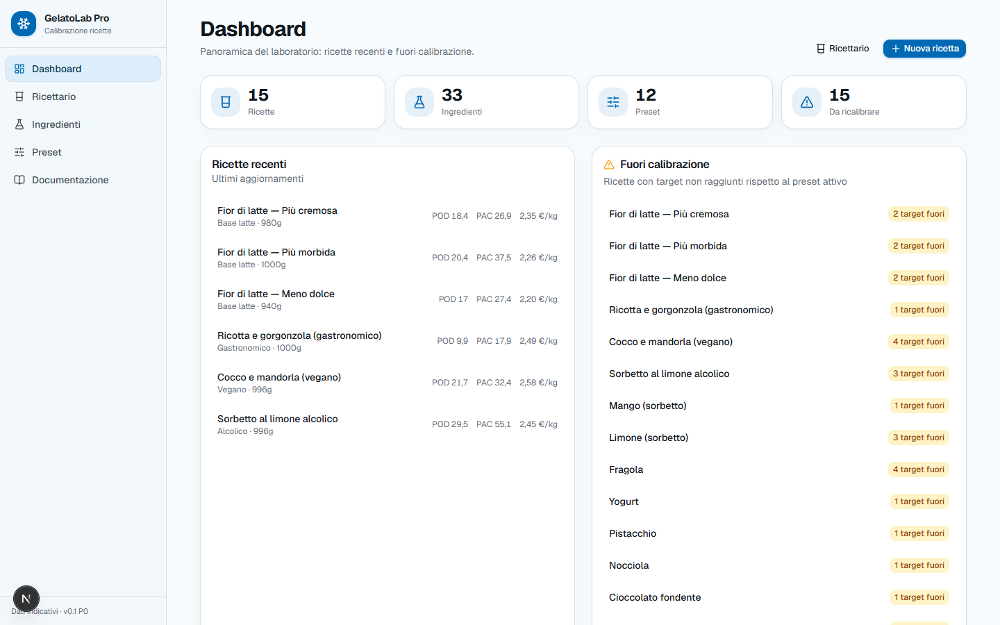
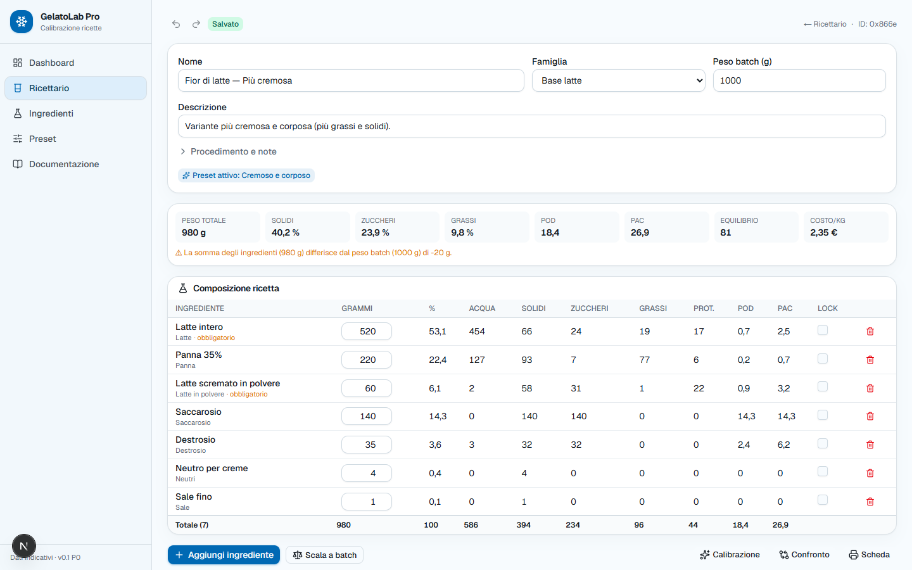
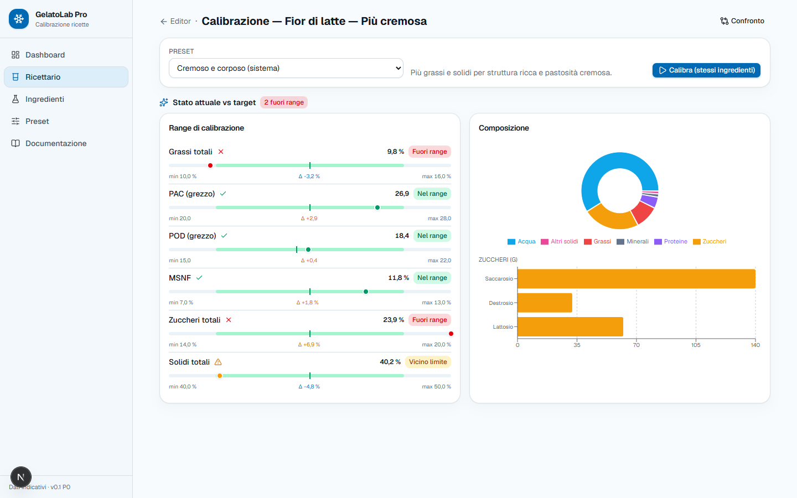
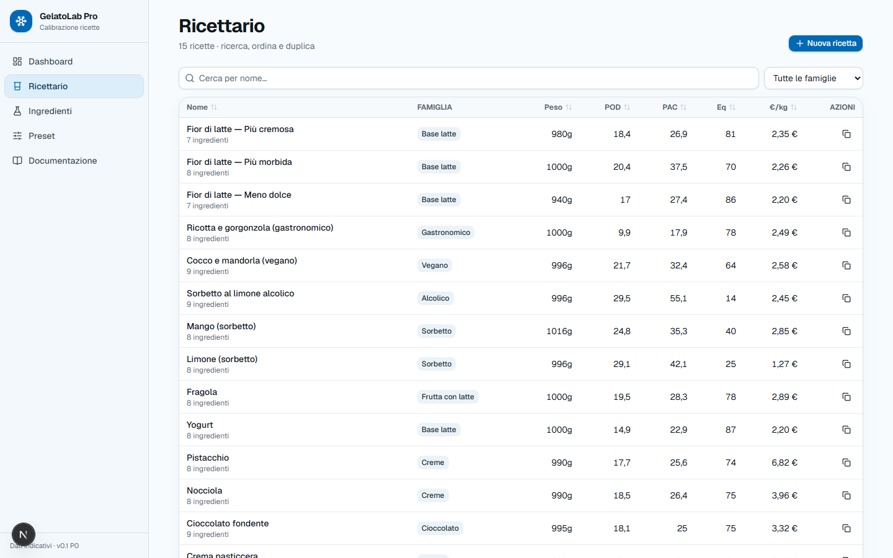
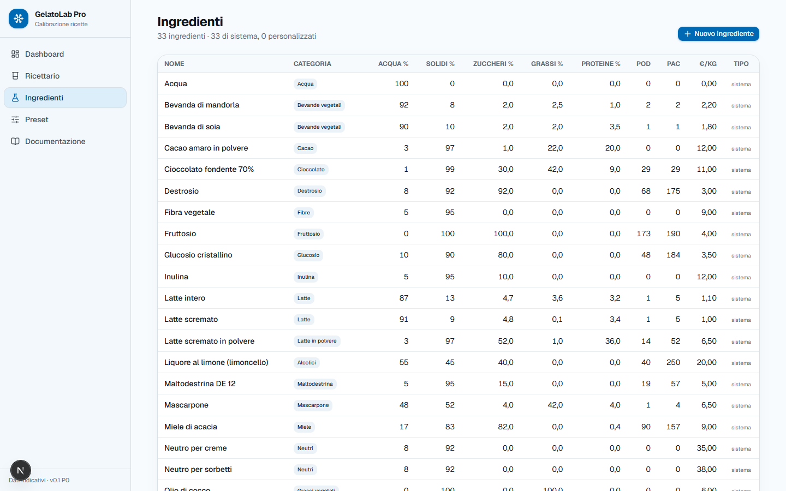
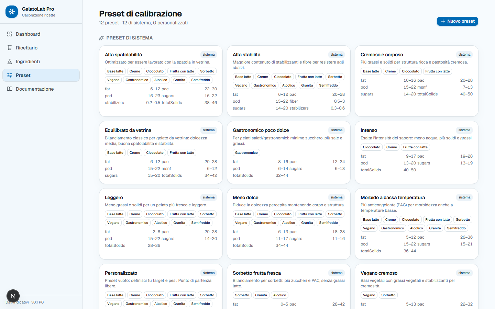
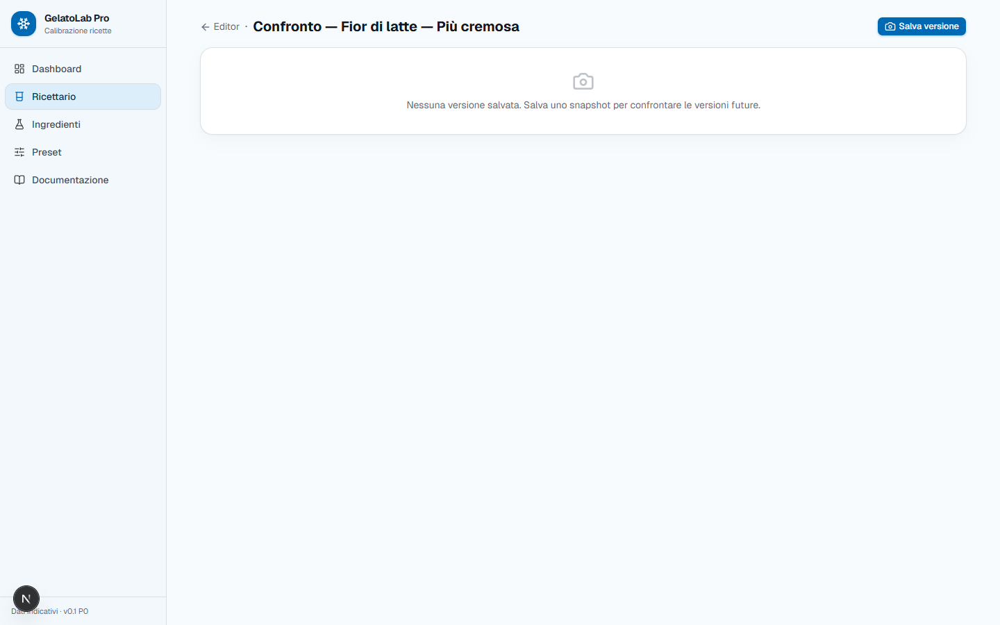
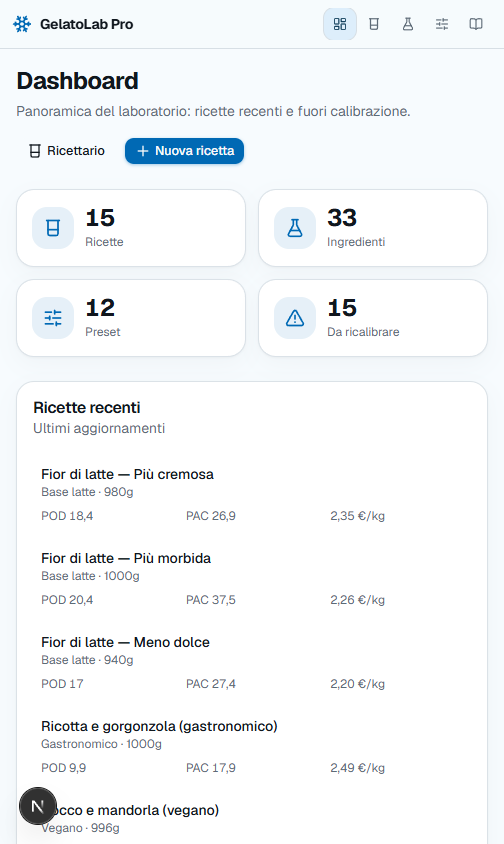
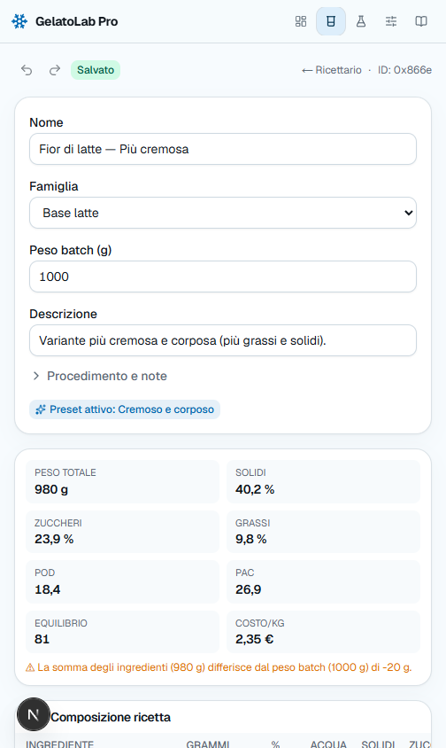
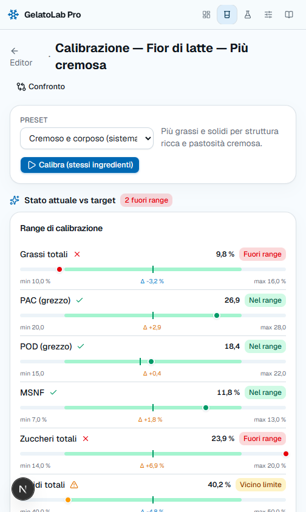

# GelatoLab Pro 🍨

**Banco di formulazione per gelato artigianale.** Crea, calibra, confronta, versiona ed esporta ricette, mostrando sempre da dove viene ogni numero.

[](https://github.com/SandroHub013/gelatolab-pro/actions/workflows/ci.yml)
[](https://nextjs.org)
[](https://react.dev)
[](https://www.typescriptlang.org)
[](https://www.postgresql.org)
[](https://www.prisma.io)
[](https://tailwindcss.com)
[](https://highs.dev)
[](https://nodejs.org)
[](#test)

---



## Cosa fa

Il gelatiere lavora con vincoli che si contraddicono: più zucchero abbassa il punto di congelamento ma alza il POD, più grassi danno struttura ma tolgono spazio ai solidi magri del latte. GelatoLab Pro rende quel bilanciamento **visibile e verificabile**.

- **Calcolo immediato** — POD, PAC, solidi, acqua, zuccheri (per tipo), grassi, proteine, MSNF, fibre, minerali, kcal e costo, ricalcolati a ogni modifica, con il contributo di ogni singolo ingrediente riga per riga.
- **Calibrazione su preset** — 12 preset di sistema definiscono i range target per famiglia. Ogni parametro mostra dove sei, dove dovresti essere e di quanto sei fuori.
- **Solver deterministico** — la programmazione lineare HiGHS propone tre soluzioni per raggiungere i target senza cambiare gli ingredienti. Non decide al posto tuo: propone, mostra i vincoli applicati e ti lascia scegliere.
- **Confronto e versioni** — gli snapshot sono immutabili. Puoi confrontare la ricetta attuale con una versione salvata e vedere il drift di composizione ingrediente per ingrediente.
- **Export** — JSON e CSV, quest'ultimo con separatore e decimale localizzati, perché il file lo apre un gelatiere in Excel.

Nessun LLM nei calcoli. Le euristiche — come la temperatura di servizio stimata — sono dichiarate tali. Un target impossibile fallisce con un messaggio esplicito invece di restituire un numero inventato.

## L'app

<table>
<tr>
<td width="50%"><b>Editor ricetta</b><br><sub>Composizione, metriche aggregate, contributo per ingrediente</sub></td>
<td width="50%"><b>Calibrazione</b><br><sub>Range target, scostamento dall'ideale, composizione</sub></td>
</tr>
<tr>
<td></td>
<td></td>
</tr>
<tr>
<td width="50%"><b>Ricettario</b><br><sub>Archivio con metriche in linea</sub></td>
<td width="50%"><b>Ingredienti</b><br><sub>Database con coefficienti POD/PAC</sub></td>
</tr>
<tr>
<td></td>
<td></td>
</tr>
<tr>
<td width="50%"><b>Preset di calibrazione</b><br><sub>Range per famiglia, pesi di ottimizzazione</sub></td>
<td width="50%"><b>Confronto versioni</b><br><sub>Diff fra snapshot e ricetta attuale</sub></td>
</tr>
<tr>
<td></td>
<td></td>
</tr>
</table>

<details>
<summary><b>Su mobile</b></summary>
<br>
<table>
<tr>
<td width="33%"></td>
<td width="33%"></td>
<td width="33%"></td>
</tr>
</table>
</details>

## Assistente vocale

Un gelatiere in laboratorio ha spesso le mani occupate, fredde o sporche. La
console vocale — il pulsante col microfono in basso a destra — copre l'intera
applicazione a voce: navigazione, modifiche alla ricetta, calibrazione,
salvataggio di versioni.

Il confine che la rende compatibile con la promessa del prodotto: **il modello
interpreta l'intento, non calcola mai un numero.** "Aggiungi duecentocinquanta
grammi di panna" diventa una chiamata alla stessa funzione che usa il pulsante,
e POD, PAC e solidi li ricalcola `src/domain/` come sempre. Le metriche che
l'assistente puo' riferire gli vengono passate gia' calcolate, apposta perche'
le legga soltanto.

| Strato | Servizio | File |
|---|---|---|
| Trascrizione | Azure Speech (`it-IT`) | `src/features/voice/use-speech-recognition.ts` |
| Interpretazione | Claude su Microsoft Foundry | `src/app/api/voice/interpret/route.ts` |
| Esecuzione | store e server action esistenti | `src/features/voice/execute-command.ts` |

Le modifiche all'editor si annullano con undo come quelle fatte a mano. Le
scritture sul server — salva versione, crea ricetta, applica soluzione del
solver — chiedono conferma prima di partire, perche' l'undo non le raggiunge.

Senza le variabili d'ambiente di `.env.example` l'applicazione funziona
identica: la console risponde con un messaggio esplicito invece di rompersi.
La chiave di Azure Speech non arriva mai al browser — `/api/voice/speech-token`
rilascia un token che scade dopo dieci minuti. L'SDK vocale, 369 KB, entra con
un import dinamico e non pesa su chi non apre mai la console.

## Requisiti

- Node.js 24+
- Docker (per PostgreSQL)

## Avvio rapido

```bash
# 1. Avvia PostgreSQL
docker compose up -d

# 2. Configura l'ambiente
cp .env.example .env

# 3. Installa dipendenze e genera il client Prisma
npm install
npx prisma generate

# 4. Migrazioni + seed (33 ingredienti, 12 preset, 15 ricette demo)
npm run db:setup

# 5. Avvia in sviluppo
npm run dev
```

> **Su Windows**, se `prisma migrate` risponde `P1001: Can't reach database server`,
> usa `127.0.0.1` invece di `localhost` nel `DATABASE_URL`: `localhost` risolve a
> IPv6 e il mapping della porta del container non risponde su quell'indirizzo.

## Architettura

Il vincolo portante è che **il dominio resta puro**: `src/domain/` non importa Prisma, né Next, né React. È dove vivono i calcoli, ed è per questo che è la parte più densa di test — si verifica chiamando funzioni, senza database né rendering.

```
src/
├── domain/              logica pura, zero dipendenze da React o DB
│   ├── calculations/    POD, PAC, solidi, contributi, solver
│   ├── constraints/     valutazione dei target di preset
│   └── validation/      schemi Zod condivisi client/server
├── app/                 App Router: pagine, route handler, server action
├── features/            moduli per dominio funzionale (ricette, calibrazione, preset)
├── components/ui/       primitive UI condivise
├── infrastructure/      Prisma, repository, mapper, singleton HiGHS
├── stores/              Zustand + zundo (undo/redo dell'editor)
└── types/               tipi ed etichette condivise
```

## Stack

| Livello | Scelta |
|---|---|
| Frontend | Next.js 16 (App Router), React 19, TypeScript strict |
| Stile | Tailwind CSS 4, Base UI |
| Stato | Zustand + zundo per undo/redo |
| Form | React Hook Form + Zod |
| Tabelle e grafici | TanStack Table v9, Recharts |
| Backend | Server Action, Prisma 7, PostgreSQL 16 |
| Solver | HiGHS via WebAssembly (programmazione lineare) |
| Test | Vitest, Playwright |

## Comandi

| Comando | Descrizione |
|---|---|
| `npm run dev` | Sviluppo |
| `npm run build` | Build di produzione |
| `npm run lint` | ESLint |
| `npm run typecheck` | `tsc --noEmit` |
| `npm test` | Vitest |
| `npm run test:e2e` | Playwright |
| `npm run db:setup` | Migrazioni + seed |
| `npm run db:studio` | Prisma Studio |
| `npm run format` | Prettier |

## Test

80 test su 7 file. La densità segue il rischio, non la superficie: i calcoli e il solver ne hanno la quota maggiore, l'escaping CSV ha un test per ogni carattere che in passato ha rotto qualcosa.

```
src/domain/calculations/     calcoli e solver
src/infrastructure/          seed e mapper
src/components/ui/           componenti, via renderToStaticMarkup
src/app/api/.../export/      escaping CSV e nomi file
```

## CI

Quattro controlli su ogni push e ogni pull request: lint, typecheck, test con coverage, build di produzione. Più un audit delle dipendenze.

## Documentazione

| File | Contenuto |
|---|---|
| [SPEC.md](./SPEC.md) | Stato, roadmap SaaS, piani di abbonamento, Jarvis |
| [DECISIONS.md](./DECISIONS.md) | Decisioni prese in implementazione, con il perché |
| [CONTRIBUTING.md](./CONTRIBUTING.md) | Setup, convenzioni, etichette |
| [SECURITY.md](./SECURITY.md) | Segnalazione di vulnerabilità |
| [AGENTS.md](./AGENTS.md) | Note per agenti che lavorano sul repo |

---

<sub>I dati degli ingredienti sono indicativi e modificabili. Le stime euristiche sono dichiarate come tali nell'interfaccia.</sub>
